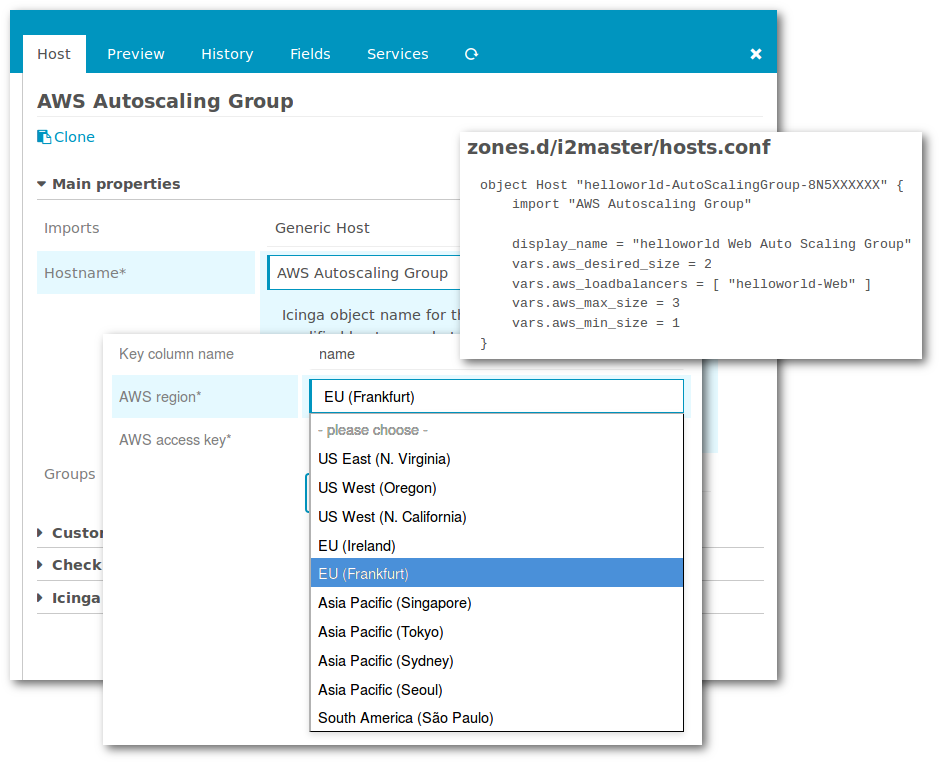

Icinga Module for AWS
=========================================

This is a simple Amazon Web Services (AWS) module for Icinga Web 2. Currently
it is nothing but an Import Source provider for [Icinga Director](https://github.com/Icinga/icingaweb2-module-director).

It allows you to configure an Director automation that new Auto Scaling Groups would
be deployed immediately as new (virtual) hosts to your [Icinga](https://www.icinga.org/)
monitoring system.

Please read the [Installation and Configuration](02-Installation-and-Configuration.md)
and [Usage](03-Usage.md) sections to learn more about this module.

