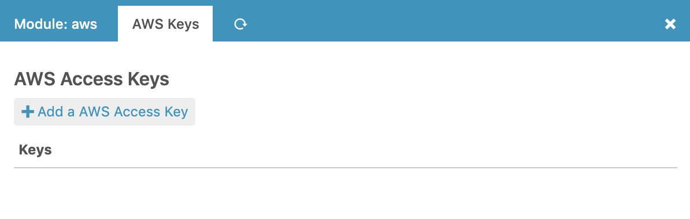
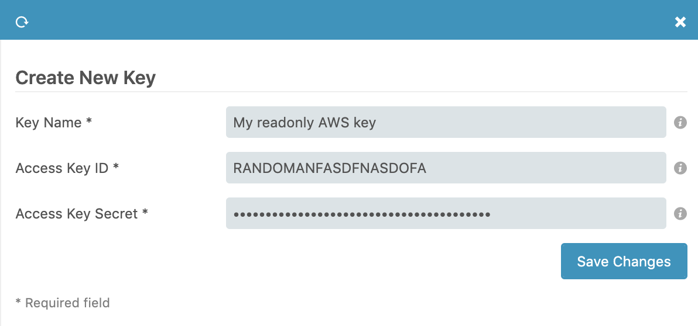

<a name="Installation-and-Configuration"></a>Installation
============

Requirements
------------

This module needs the [AWS PHP SDK v2](http://docs.aws.amazon.com/aws-sdk-php/v2/guide/).
The newer v3 requires PHP 5.5, a version not available without 3rd party
(or SCL) repositories on many Enterprise Linux distributions as of this
writing. So to make life easier for many people we decided to work with
the older SDK.

Module installation
-------------------

Please extract or clone this module to your Icinga Web 2 module path. The
directory name must fit the module name, `aws`. This would usually lead to
`/usr/share/icingaweb2/modules/aws`.

Download AWS SDK
----------------

Next please download and extract the [latest v2](https://github.com/aws/aws-sdk-php/releases/download/2.8.30/aws.zip) standalone ZIP archive from
the AWS PHP SDK [releases](https://github.com/aws/aws-sdk-php/releases) page.
You need to extract the AWS PHP SDK v2 to `library/vendor/aws`.

AWS IAM role credentials
------------------------

If you run Icinga Web on AWS you can use IAM roles to allow access. This is the
default and there is nothing to configure. Select IAM role and configure access
in AWS itself. 


AWS key configuration
---------------------

If you want to use access keys you need to have at least one key in `keys.ini`.
The easiest way to do that, is by going to the key configuration tab in `Icinga Web 2` under `Configuration > Modules > aws > AWS Keys`:



After that just click `Add a AWS Access Key`, choose a name and add your key details:



That's it. Now you are ready to enable the AWS module and you'll find a new
Import Source in your Icinga Director frontend. You are now ready to skip to
the [Usage](02-Usage.md) section.

Proxy usage
-----------

In case your server needs to use a proxy when connection to the AWS web service
please create `/etc/icingaweb2/modules/aws/config.ini` with a `network` section
like shown in this example:

```ini
[network]
proxy = "192.0.2.192:3128"
```

You could also pass proxy credentials in the form `user:pass@host:port`.

SSL issues
----------

In case you need to provide a specific SSL CA bundle, once again please create
a `[network]` section in your `config.ini`:

```ini
[network]
ssl_ca = "/etc/ssl/certs/ca.pem"
```
