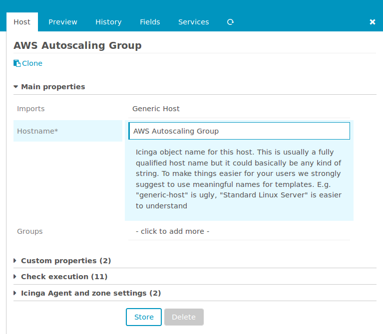
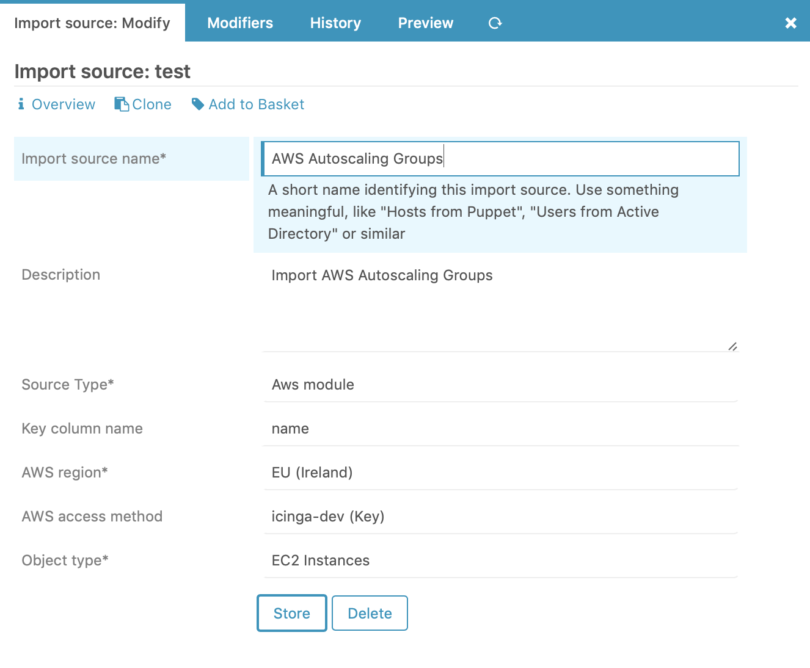
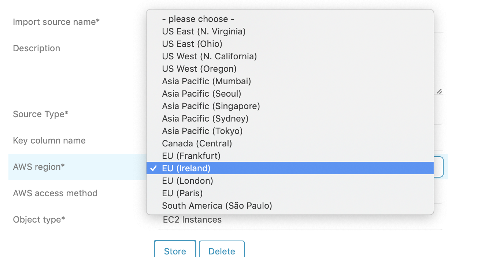
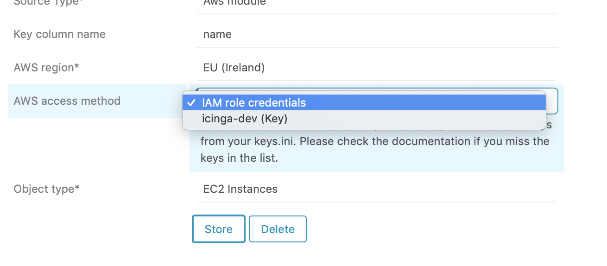
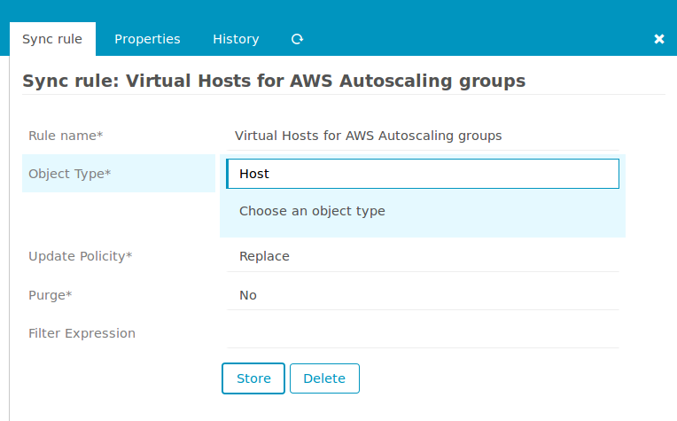
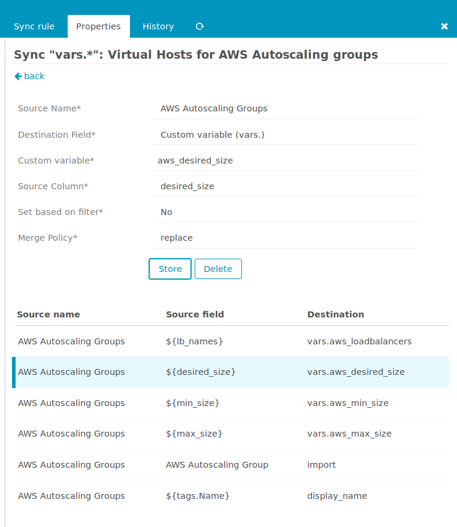
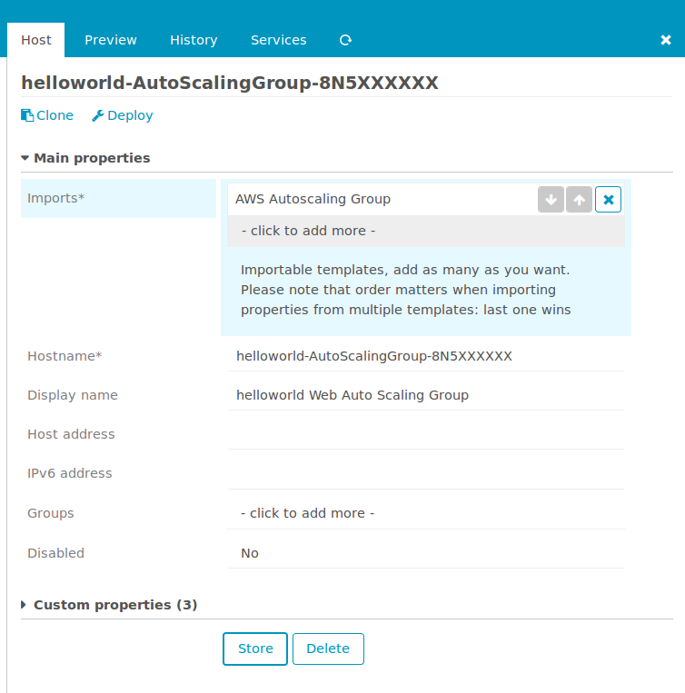
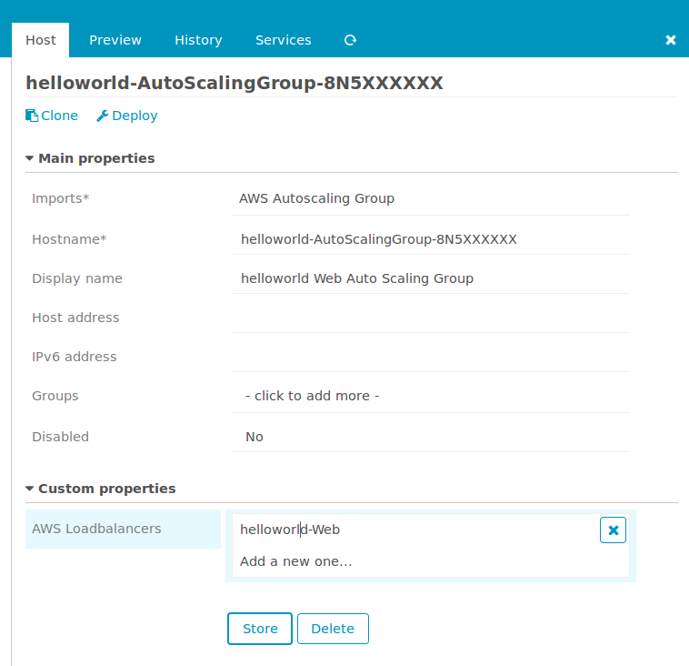
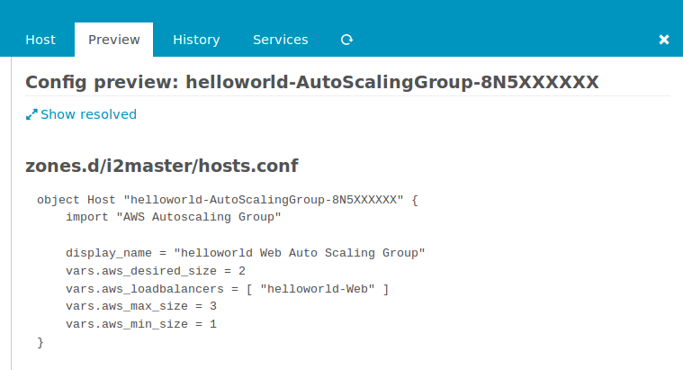

Usage
=====

Dynamically create hosts for AWS AutoScaling Groups
---------------------------------------------------

Our first use case are virtual Icinga host objects, one for each of your AWS
AutoScaling Group. Single instances come and go, it's tricky to monitor them
in a meaningful way. Your AutoScaling Groups are here to stay, it is vital for
your service that they are alive.

This example wants to teach you how to configure Director to automagically do
this for you.

### Create IAM User

We suggest creating a new user for Icinga2. In order to use all features of this
module, assign the following policy to the user:

arn:aws:iam::aws:policy/AmazonEC2ReadOnlyAccess

### Create a new host template

I'd strongly suggest to create a dedicated template that should be inherited
by all your virtual AWS ASG hosts. This allows you to add service checks to
the template, with the Director automagically deploying them as apply rules
affecting all your ASG hosts.

Whether you use a dummy host check or a plugin running against the AWS API is
up to your personal preference.

### Define a dedicated Import Source

As soon as you installed and enabled this module, a new Import Source will be
available in your Icinga Director web frontend:

You can choose your AWS region from a dropdown:

It is also necessary to choose one of your AWS keys:

In case this list is empty, please check back to the [Installation and Configuration](01-Installation-and-Configuration.md)
section. Now you are ready to preview and/or run your first import. Don't
worry, nothing bad will happen. An Import run just imports plain data from
your import source, it won't touch any of your hosts or services in your
Icinga Director.

### Create a Sync Rule

Our Sync Rules are responsible for creating real Icinga objects based on
data imported through one or more Import Sources. So let's create a new
rule:

Sync Properties allow you to specify how to treat the various properties
in a granular way:

Now you are ready to trigger your first Sync Run. Activity Log and Sync History
will show you what related actions took place

### Have a look at your new hosts

Let's have a look at our newly created host:

In case you want to achieve visibilty for your imported Custom Vars please
define related Fields directly on your AWS ASG Template. Your hosts could
then look as follows:

The preview tab shows our rendered host, this is how it will get deployed
to Icinga:

That's all for now, have fun!
